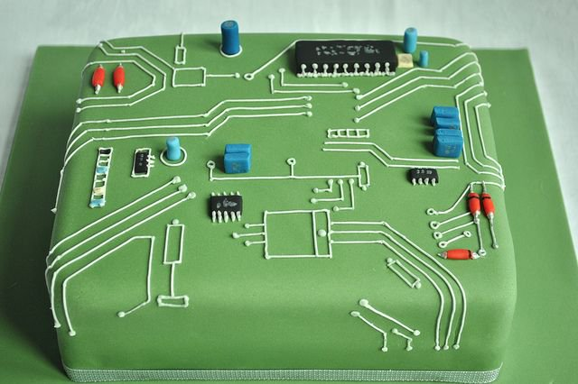

## asm2c

 

  
This a swift tool to transform DOS/PMODEW 386 TASM assembly code to C code.  
Made to port [Mr.Boom](https://github.com/Javanaise/mrboom-libretro)

see [BUGS.md](BUGS.md) and check [this project](https://github.com/xor2003/masm2c)